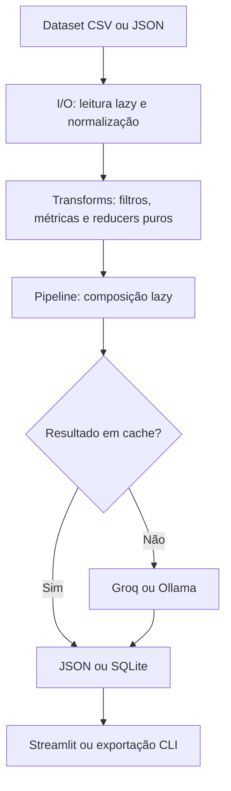

# DeepCheckPR

[](https://github.com/frebarcelos/DeepCheckPR/actions/workflows/ci.yml)


[](LICENSE)

DeepCheckPR é uma aplicação para explorar e classificar datasets de Pull
Requests. O projeto combina um pipeline funcional e lazy em Python com
classificação semântica via Groq ou Ollama, cache persistente e um dashboard
Streamlit para filtros, métricas, gráficos e exportação.

O projeto nasceu como trabalho acadêmico coletivo na disciplina de Linguagens
de Programação da UNIPAMPA e foi preparado para servir como portfólio técnico
dos cinco integrantes. A autoria e as contribuições individuais estão
documentadas em [Autores e créditos](#autores-e-créditos).

> **Demonstração visual:** ainda não há uma captura ou GIF versionado. Uma
> imagem da visão geral do dashboard será adicionada aqui em uma próxima etapa.

## Problema resolvido

Revisar grandes coleções de Pull Requests manualmente torna difícil identificar
padrões de linguagem, tipo de projeto, natureza da contribuição, clareza da
descrição e complexidade de revisão. O DeepCheckPR transforma arquivos CSV ou
JSON em um fluxo analisável e oferece duas formas de uso:

- dashboard interativo para exploração e exportação;
- pipeline de linha de comando para processamento reproduzível em lote.

## Principais funcionalidades

- leitura lazy de CSV com detecção e adaptação de schema;
- suporte a datasets JSON no formato de comentários minerados;
- filtros por estado, linguagem, tamanho e presença de descrição;
- transformações puras com `map`, `filter` e `reduce`;
- classificação de tipo de projeto, natureza da contribuição, clareza e
  complexidade de revisão;
- backends LLM Groq e Ollama;
- processamento serial, concorrente, por batch e com tool calling;
- heurísticas locais para reduzir chamadas ao modelo;
- cache SHA-256 em memória com persistência JSON;
- cache SQLite persistente com WAL e sincronização entre threads;
- result-cache entre sessões para evitar reclassificação de PRs conhecidos;
- dashboard Streamlit com KPIs, tabelas, gráficos e exportação CSV/JSON;
- CLI para amostras ou datasets completos;
- testes unitários, testes de integração local e property-based testing.

## Arquitetura e fluxo



| Módulo | Tipo | Responsabilidade |
|---|---|---|
| `io/` | efeito colateral | leitura, schemas e exportação |
| `transforms/` | puro | filtros, mapeadores, heurísticas e reducers |
| `pipeline/` | puro | composição e construção lazy do fluxo |
| `cache/` | misto | chaves, LRU, JSON e SQLite |
| `llm/` | efeito colateral | clientes, classificação, batching e métricas |
| `ui/` | efeito colateral | dashboard, visualizações e adapters pandas |

Os módulos `transforms/` e `pipeline/` não realizam I/O nem mantêm estado global
mutável. Um verificador AST próprio reforça as regras funcionais no pre-commit e
na integração contínua.

## Tecnologias

- Python 3.11+
- Streamlit, pandas e Plotly
- Groq API e Ollama
- SQLite, JSON e `hashlib`
- pytest, pytest-cov e Hypothesis
- Ruff, mypy e pre-commit
- Docker e Docker Compose
- GitHub Actions

## Instalação local

### Pré-requisitos

- Python 3.11 ou 3.12;
- Git;
- uma chave Groq **ou** uma instalação local do Ollama.

```bash
git clone https://github.com/frebarcelos/DeepCheckPR.git
cd DeepCheckPR
python -m venv .venv
```

Ative o ambiente virtual:

```powershell
# Windows PowerShell
.\.venv\Scripts\Activate.ps1
```

```bash
# Linux ou macOS
source .venv/bin/activate
```

Instale o projeto e as ferramentas de desenvolvimento:

```bash
python -m pip install --upgrade pip
pip install -e ".[dev]"
```

Crie a configuração local:

```powershell
Copy-Item .env.example .env
```

```bash
cp .env.example .env
```

Depois de configurar o backend, inicie o dashboard:

```bash
streamlit run src/pr_analyzer/ui/app.py
```

A aplicação estará disponível em `http://localhost:8501`.

## Execução com Docker

```powershell
Copy-Item .env.example .env
docker compose build
docker compose up app
```

No Linux ou macOS, troque o primeiro comando por `cp .env.example .env`.

O dashboard ficará disponível em `http://localhost:8501`. O Compose monta os
diretórios `data/` e `cache/`, mantendo datasets e resultados fora da imagem.

Para rodar a suíte dentro do container:

```bash
docker compose run --rm -T app python -m pytest tests/ -m "not integration"
```

## Configuração dos backends LLM

### Groq

```dotenv
LLM_BACKEND=groq
GROQ_API_KEY=gsk_your_key_here
LLM_MODEL=llama3-8b-8192
```

### Ollama

Instale o Ollama, baixe um modelo compatível e ajuste o `.env`:

```bash
ollama pull qwen2:1.5b
```

```dotenv
LLM_BACKEND=ollama
LLM_MODEL=qwen2:1.5b
OLLAMA_HOST=http://localhost:11434
```

Quando o DeepCheckPR estiver dentro do Docker, use:

```dotenv
OLLAMA_HOST=http://host.docker.internal:11434
```

### Variáveis de ambiente

| Variável | Padrão | Uso |
|---|---:|---|
| `LLM_BACKEND` | `groq` | seleciona `groq` ou `ollama` |
| `GROQ_API_KEY` | — | credencial exigida pelo backend Groq |
| `LLM_MODEL` | `llama3-8b-8192` | modelo do backend selecionado |
| `OLLAMA_HOST` | `http://localhost:11434` | endpoint do Ollama |
| `LLM_MAX_WORKERS` | `auto` | concorrência, fixa ou detectada localmente |
| `LLM_USE_TOOLS` | `false` | habilita classificação por tool calling |
| `LLM_BATCH_SIZE` | `1` | PRs por chamada em modo batch |
| `LLM_MAX_RETRIES` | `3` | máximo de novas tentativas |
| `LLM_RETRY_BASE_DELAY` | `1.0` | base do backoff em segundos |
| `LLM_BODY_CHARS_SINGLE` | `400` | limite do corpo em chamadas individuais |
| `LLM_BODY_CHARS_BATCH` | `100` | limite do corpo em chamadas batch |
| `FILTER_STATE` | vazio | estado aceito pelo pipeline configurável |
| `MIN_CHANGES` | `0` | mínimo de adições mais remoções |
| `ENABLE_LLM` | `false` | aplica classificador fornecido ao pipeline |
| `DATASET_PATH` | `data/github_prs.csv` | entrada padrão da CLI/Makefile |
| `MAX_UPLOAD_SIZE_MB` | `10240` | limite de upload do Streamlit no Compose |

O `.env` é ignorado pelo Git. Nunca substitua os placeholders do
`.env.example` por credenciais reais.

## Datasets e CLI

Datasets não são distribuídos com o repositório. Coloque arquivos locais em
`data/`, que é ignorado pelo Git, preservando apenas `data/.gitkeep`.

O schema CSV canônico contém:

```text
pr_id,repo_name,language,title,body,state,created_at,merged_at,
additions,deletions,changed_files
```

Para processar uma amostra via Docker:

```bash
docker compose run --rm app python scripts/run_pipeline.py \
  data/arquivo.csv output.json 100
```

Use limite `0` para processar todo o arquivo:

```bash
docker compose run --rm app python scripts/run_pipeline.py \
  data/arquivo.json output.json 0
```

## Testes e qualidade

```bash
pytest tests/ -m "not integration" --cov=src/pr_analyzer --cov-fail-under=80
ruff check src/ tests/ scripts/
ruff format --check src/ tests/ scripts/
mypy --no-site-packages src/
python -X utf8 scripts/check_paradigm.py
```

Os testes marcados como `integration` podem chamar um backend LLM real e não
fazem parte da execução padrão:

```bash
pytest tests/ -m integration
```

### Métricas verificadas

Medição local realizada em **16 de julho de 2026**, com Python 3.12.13 e
pytest 8.4.2:

| Métrica | Resultado |
|---|---:|
| Testes aprovados | 535 |
| Testes de integração desmarcados | 1 |
| Tempo da suíte | 7,26–9,13 s em duas execuções |
| Cobertura total com branches | 89% |
| `cache/`, `pipeline/`, `io/`, `transforms/` | 100% |
| `llm/classifiers.py` | 94% |
| `llm/system_probe.py` | 39% |

A medição de cobertura exclui `ui/` e `llm/client.py`, conforme o
`pyproject.toml`. O projeto ainda não possui um benchmark reproduzível de
throughput LLM; tempos de classificação variam conforme modelo, hardware,
backend, concorrência, batching e estado do cache.

## Limitações conhecidas

- a UI Streamlit e o cliente HTTP LLM ainda não entram na métrica de cobertura;
- a sondagem de hardware depende do sistema operacional e tem cobertura menor;
- respostas LLM podem variar entre modelos e execuções;
- arquivos de archive muito grandes são carregados por streaming e amostragem;
- o repositório não inclui datasets nem modelos Ollama;
- a primeira classificação depende da disponibilidade do backend escolhido;
- métricas de desempenho do pipeline LLM ainda precisam de benchmark público e
  reproduzível.

## Autores e créditos

DeepCheckPR é resultado de trabalho coletivo. A divisão abaixo foi conferida
contra o histórico Git e o código atual; integrações e correções atravessaram
mais de um módulo ao longo do projeto.

| Integrante | Contribuições principais confirmadas |
|---|---|
| **Bernardo Gomes Dorneles** (`bNDorneles`) | modelo `PRRecord`, leitura lazy, schemas, validação de linhas, exportadores e testes de integração de I/O |
| **Pedro Henrique** | filtros e transformações puras, métricas, reducers, agregações e property-based testing com Hypothesis |
| **Dean Vargas - DVA** | base dos clientes e classificadores LLM, contratos de saída, enriquecimento e classificação segura |
| **Frederico Barcelos** (`frebarcelos`) | sistema de cache; persistência JSON e SQLite; SQLite concorrente com WAL, lock e conexão compartilhável; composição e construção do pipeline; pipelines lazy; configuração por ambiente; integração do cache ao fluxo e result-cache entre sessões |
| **Diogo** (`diogo2m`) | dashboard Streamlit, componentes e visualizações, carregamento de datasets, adapters pandas, uploads e integração da interface com o pipeline |

Commits de integração, correções de compatibilidade, documentação e melhorias de
desempenho foram realizados colaborativamente e continuam preservados no
histórico do repositório.

## Contribuição e uso de IA

Consulte [CONTRIBUTING.md](CONTRIBUTING.md) para configurar os hooks, seguir as
regras funcionais e usar ferramentas de IA de forma agnóstica e responsável.

## Licença

Distribuído sob a [licença MIT](LICENSE), em nome de todos os contribuidores do
DeepCheckPR.
